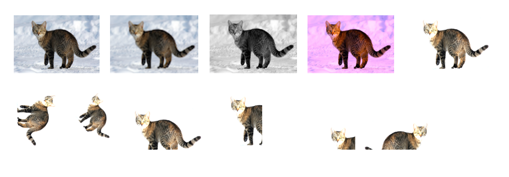

# Data Augmentation for Natural Language Text Datasets

| Anooshik Vartanian                | Adam Bittlingmayer             
| :--------------------------------:|:--------------------------:
| American University of Armenia    | Signal N
| ` anooshik_vartanian@edu.aua.am ` | ` adam@bittlingmayer.org `


### Abstract

Data augmentation is a standard technique for improving accuracy in many machine learning tasks, but not in natural language tasks.  In fact, lossy normalisation - the opposite - is far more common.

We propose applying a basic set of noise types based on 1) random insertions, deletions and repetitions 2) small hand-built lists of exchangeable tokens 3) common keyboard layouts.

The approach is implemented as an open-source Python library, NoiseMix [https://github.com/noisemix].

Basic data augmentation resulted in significant gains across the tasks of question topic tagging, sentiment analysis and language identification.

Keywords:

[1 Introduction](#1-introduction)  
[2 Background](#2-background)  
[3 Implementation](#3-implementation)  
[4 Results](#4-results)  
[5 Conclusion](#5-conclusion)  
[6 Appendix](#6-appendix)  

---

## 1 Introduction

Machine learning generally improves with more data on all tasks.  However labelled datasets for training models for supervised tasks are far fewer and smaller than simple unlabelled datasets for training unsupervised models.

Small datasets lead to overfitting - sensitivity to noise and unpredictability on out-of-domain data.  One reaction to this is lossy normalisation of data or dimensionality reduction of the learned model, which leads to underfitting.

Data augmentation is a standard technique for many machine learning tasks.  By generating semi-realistic new data from existing data, dataset size is effectively increased.  The resulting models are more accurate.  One downside in practice is increased training time.

With the increases in computing power and data, machine learning has evolved towards approaches for larger and noisier datasets.  Machine learning for natural language tasks is no exception: ever more natural language text data specifically is user-generated and in multiple languages.

However data augmentation for natural language text datasets has some unique challenges inherent to language, and is not standard.  Current implementations are task-specific and thus cannot be generalised and are not standard.  In fact, lossy normalisation - the opposite - is far more common.

We propose applying a basic set of noise types based on 1) random insertions, deletions and repetitions 2) small hand-built lists of exchangeable tokens 3) common keyboard layouts.

The approach is implemented as an open-source Python library, NoiseMix[], with parameters for noise and support for the English language and for the fastText supervised label format.

Basic data augmentation resulted in significant gains across classification tasks of question topic tagging, sentiment analysis and language identification.  The exact results vary according to the parameters, the size and noisiness of the original data and the exact type of task.

## 2 Background

One inherent challenge of natural language is the sparseness, which is well-discussed in the context of the inspiration for word embeddings.  Small changes could break the grammatically or produce nonsense.

For data generation this means a real risk that output is unrealistic or invalid language.

Another inherent challenge is the arbitrary  meaning of signs.  Small changes could change the meaning, even to the exact opposite - in almost all languages there are negation particles that are short or even only one character (eg English *not*, or *'t* in *can't*).

For data generation this means a real risk that the output is valid but the label is no longer correct.

Yet another inherent challenge is the ambiguity.  In many cases there are multiple meanings, or meanings dependent on context.  A word cannot simply be swapped with hardcoded lists of synonyms.

For data generations this means that natural language understanding for each language and domain would be ideal.

### Images

The intuition behind data generation for image tasks is straightforward.  Consider the task of image labelling.


*The first image is the original, it is labelled 'cat'.  If there are few images with that label, the trained model can easily overfit.*

*For example, the model could label an image as `cat` because of a snowy background, colour spectrum, a specific fur colour, specific pose or specific place in the image.*

*We generate the rest of the images by applying transforms or combinations of transforms, but keep the label `cat`.  The resulting dataset is 10x larger.*

Data generation for images is so standard that it is a built-in component of major machine learning frameworks like Tensorflow[], Keras[] and PyTorch[].

### Natural Language Audio

### Natural Language Text

Task-specific: machine translation, translit/grammar/spelling, NER.

One fairly common approach to the sets of problems solved is the use of pre-trained vectors trained either on raw text data or optimised for another supervised tasks for which there is more data.

## 3 Implementation
Char-level vs word-level
Link to Appendix / Noise Types

#### Formats

## 4 Results

The benchmarks used are all classification tasks.  This is a restriction of the fastText library.

StackExchange questions tagging[]  
10K+ rows, 100+ classes, multi-label classification, English

Tatoeba language identification[]  
? rows, 100+ classes, single label classification, 100+ languages

Amazon Reviews sentiment analysis[]  
1M+ rows, 2 classes, single label classification, English

vs baseline
vs more real data
% improvement, % errors cut

## 5 Conclusion

1 - Even simple noisification is very effective.
2 - Most of the information about features that are meaningful for a given task is in any small random subset of the rows, after that mostly only non-task-specific noise is being learnt.


### Future work
Benchmarks on more diverse tasks, eg seq2seq
More data formats and integrations  
More languages, keyboard layouts etc  
Learn noisification models from raw data or pre-trained vectors  
Noisification as a hyperparameter - grid search  

### References

https://deepmind.com/blog/cognitive-psychology/

## 6 Appendix

TOC

### Noise Types

### Output

#### Downloads
Links to actual datasets

#### Samples
Sample rows
Sample predictions by noisified model vs baseline model

### Reproducing
Explanation of how to reproduce the results
On a Unix system with Python 3:
```
pip install noisemix
python -m noisemix
...
```
